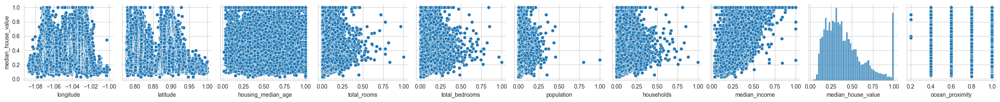
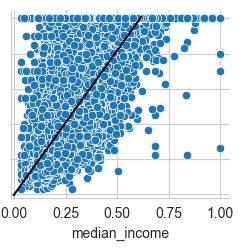
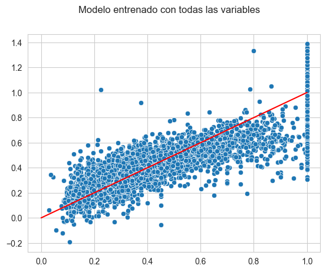
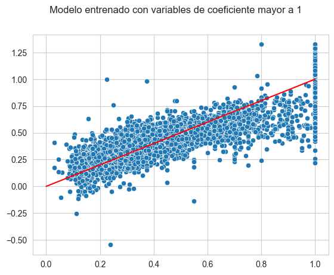
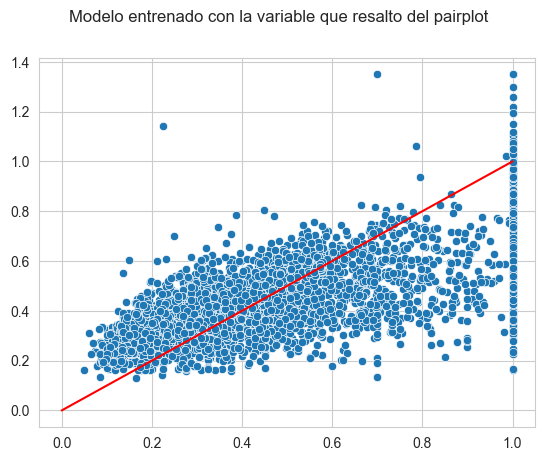
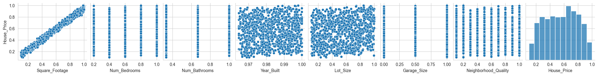
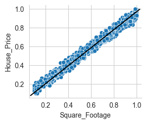
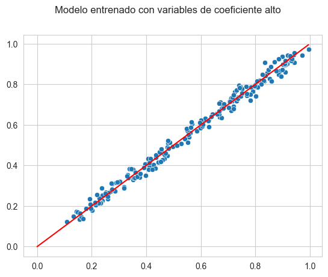
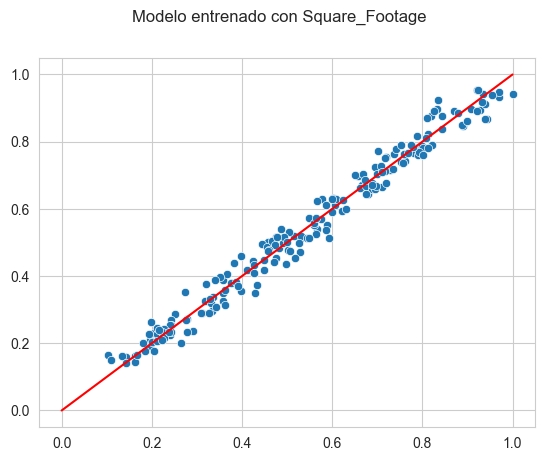

# 2da parte del Proyecto 2 de Python Avanzada: Regresión Linear Múltiple

Para esta parte del proyecto, nosotros analizaremos dos datasets:
1. Un dataset con información de casas en california ([link](https://www.kaggle.com/datasets/camnugent/california-housing-prices))
2. Un dataset, también con info de casas, pero diseñado para un análisis con regresión ([link](https://www.kaggle.com/datasets/prokshitha/home-value-insights))

Ahora, desarrollaremos el proceso a través del cual analizamos los datasets, como entrenamos modelos en base a ellos, y las conclusiones a las cuales llegamos

# 1er Dataset

Comenzando el análisis del primer dataset, se hizo un preprocesamiento básico, transformando las columnas categóricas que había en numéricas, y normalizando las variables (paso importante para  poder analizar los coeficientes al entrenar el modelo de regresión mas adelante)

También se realizo un pairplot entre la variable que queremos predecir (median_house_value) y las otras variables, para observar potenciales relaciones entre ellas



Si bien todos los gráficos parecen estar bastante dispersos, se observa una vaga relación con la variable "median_income", como se puede ver en la siguiente figura.



Podemos pensar entonces que esta variable seguramente va a tener un coeficiente relevante cuando entrenemos nuestro modelo


Ahora ya, pasando a la creación y el entrenamiento del modelo, nuestro primer modelo tomo en cuenta todas las variables. Esto se hizo principalmente para poder observar los coeficientes resultantes del entrenamiento, que nos dirán la importancia de nuestras variables, ya que todas estas están normalizadas entre el rango de 0 y 1
A continuación se puede ver un diagrama comparando las predicciones del modelo entrenado con los valores reales (marcados con la linea roja)



Este modelo, al puntuarlo, llego a un porcentaje de certidumbre de 63-65%, no muy preciso.
Además obtuvimos los siguientes coeficientes y la ordenada al origen:

>```
>	Coeficientes:
>	Columna longitude: -8.804814575566258
>	Columna latitude: -3.180317776830438
>	Columna housing_median_age: 0.12325375845047226
>	Columna total_rooms: -0.5980681215838309
>	Columna total_bedrooms: 1.376674786752316
>	Columna population: -3.0306180048358744
>	Columna households: 0.7556419367013809
>	Columna median_income: 1.1764782672473935
>	Columna ocean_proximity: -0.08108021195260418
>	
>	Ordenada al origen: -6.418576078222419
>```

Usando esta información, creamos un segundo modelo, usando las variables cuyos valores absolutos de coeficientes fueron mayores a 1

A continuación, se puede ver el desempeño de este segundo modelo



Este modelo llego a una puntuación de aproximadamente 62%, por lo que al deshacernos de las variables de bajo coeficiente, pudimos optimizar el tiempo de entrenamiento sin sacrificar demasiado la precisión del modelo.

Finalmente, cerrando el análisis de este primer dataset, se intento entrenar el modelo simplemente  con la variable que habíamos teorizado al analizar el pairplot (median_income)



Si bien este modelo tuvo un desempeño mucho peor, teniendo una precisión del 47%, esto no esta demasiado alejado del desempeño aproximado del 60% de los otros modelos, pudiendo esta variable por su cuenta obtener un 78% del poder de predicción de los otros modelos, lo que en cierto modo verifica su importancia.

# 2do Dataset

El segundo dataset que analizamos, si bien no fue tan interesante de analizar (pues se observo una relación muy obvia con el pairplot), sirvió de ejemplo para lo que seria un modelo muy preciso.

Igual que en el primer dataset, la variable que quisimos predecir en este fue el precio de las casas.
Seguimos un procedimiento parecido para el preprocesamiento, normalizando las variables, aunque no hubo que convertir ninguna columna categórica, pues no había alguna.

A continuación se puede ver un pairplot comparando la variable a predecir (House_Price) con las otras en el dataset



Aquí se observa una relación muy notable entre "Square_Footage" y "House_Price", pues su grafico se asemeja considerablemente a una recta



Siguiendo al entrenamiento, igual que en el primer dataset, comenzamos entrenando el modelo con todas las variables, buscando conseguir el modelo mas preciso posible, y también para poder analizar los coeficientes.


Este modelo llego a una puntuación casi del 100% (puntuado como 99,8%).
Además, conseguimos los siguientes coeficientes y ordenada al origen del modelo:

>```
>	Coeficientes:
>	Columna Square_Footage: 0.9028414245146422
>	Columna Num_Bedrooms: 0.04726697006715856
>	Columna Num_Bathrooms: 0.02164211723797494
>	Columna Year_Built: 1.862500224663594
>	Columna Lot_Size: 0.06888764565498313
>	Columna Garage_Size: 0.0084438607431317
>	Columna Neighborhood_Quality: -0.0020214463497566053
>	
>	Ordenada al origen: -1.8633916454013773
>```

Analizando los coeficientes, se observa que la mayoría de las variables tiene una relación muy pobre, excepto por "Square_Footage" y "Year_Built"

Igual que en el primer dataset, entrenamos otro modelo con solo estas variables, con el objetivo de minimizar la información requerida para armar el modelo



Esta versión del modelo llego a un puntaje del 98,9%, siendo todavía bastante preciso.


Finalmente, cerrando el análisis de este segundo dataset, hicimos un tercer modelo con solo la variable "Square_Footage", que había resaltado en el pairplot



Este modelo llego a un puntaje de aproximadamente 98%, mostrando que la variable "Square_Footage" por si sola tiene la relación mas importante en todo el dataset, confirmando lo sospechado en el análisis del pairplot.